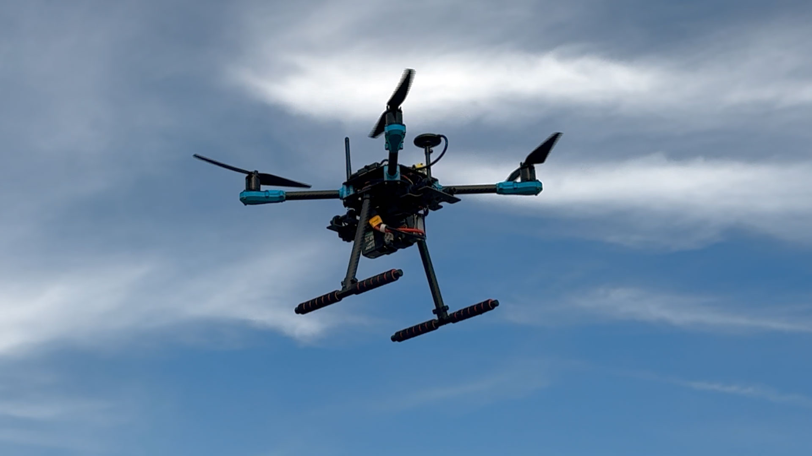

# Ariadne: Low-Cost Self-Diagnosing Navigation and a Fiber-Optic Lifeline for GNSS- and Radio-Denied Drone Flight

**A commodity drone that predicts its own navigation collapse from onboard telemetry before it silently drifts, bounds the residual with cheap printed visual anchors, and stays connected through a fiber tether where radio dies. One sub-2 kg quadcopter, both halves of the thread, fully open method and dataset.**

> Codename *Ariadne*, after the thread that guides you out of the labyrinth. The thread has two halves, and so does this project: the drone's inner sense of the way — knowing when it is losing it — and the literal lifeline back, a fiber tether that carries that truth out where radio cannot reach.

| | |
|---|---|
| **Author** | Filip Pepliński, student, ALO przy PJATK, Poland |
| **Advisor** | Szymon P. Pepliński (infrastructure, safety of flight operations, review) |
| **Status** | Phase 2: E1 screening campaign running since 12 Sep 2026; **32 accepted GNSS-denied runs** in six sessions (as of 21 Sep) |
| **Target venues** | EUCYS / Odkrycia (submission 31 Dec 2026); E(x)plory 2027 → Regeneron ISEF |
| **License** | Code: MIT. Dataset and documentation: CC BY 4.0 |
| **Last revised** | 23 Aug 2026 |

> **Scope of the December 2026 submission: RQ1, RQ2 and RQ3.** The fiber half (RQ4) is built and characterized in 2027 and is present here as the project's frame, not as a claimed 2026 result. See §5 for the schedule and the fallback rule that protects the navigation half.

---

## Abstract

When a micro-UAV flies where satellites and radio cannot reach — a metro tunnel, a collapsed building — it does not merely lose its position; on low-cost hardware it loses the *knowledge* that it is lost, reporting a confident estimate while drifting tens of meters. This silent-failure mode is what makes commodity drones untrustworthy near people and infrastructure. Ariadne asks whether a commodity optical-flow drone — a EUR 30 flow sensor on a sub-2 kg quadcopter — can (1) predict its own navigation collapse from the sensor-health telemetry it already produces, distinguishing "announced" degradation from silent drift, with measurable lead time; and (2) bound the residual drift with sparse printed visual anchors. The project also characterizes how a lightweight fiber tether carries that honest failure signal and video back out where radio dies — the connection half of the same trust problem. We answer with a reproducible denial protocol on commodity ArduPilot hardware, a characterization of the failure boundary across surface, illuminance, altitude and speed, and an open dataset. The methodological device — log GNSS as truth but exclude it from the estimator — lets anyone repeat the study without a motion-capture lab.

## 1. Motivation

This project started on a station platform, not in a literature review.

On an ordinary school morning in June 2026, the Warsaw metro line the author takes to school stopped for several hours. The cause, announced later, was mundane: an unauthorized person had entered a tunnel. The consequence was not mundane at all. Before service could resume, the tunnel section had to be verified as clear, and that verification was done the only way currently possible: slowly, by people, on foot, with the line shut down. Tens of thousands of passengers waited above a piece of infrastructure that no machine could quickly inspect. *[ref: incident report / komunikat Metra Warszawskiego, to be cited]*

The obvious question was: why could nobody just fly a small drone through the tunnel and look?

Decomposing that question technically is what defines this project. A micro-UAV in a metro tunnel loses, simultaneously, everything it normally depends on: satellite positioning (meters of concrete and earth overhead), usable light (emergency lighting at best), visual texture for optical navigation (uniform concrete surfaces), and its radio links, both control and video, which die at the first bend or a few hundred meters of tunnel. Each of these failures is individually known. What is much harder to find is **quantitative, reproducible data on where exactly the failure boundaries lie for low-cost hardware**, and therefore on how far commodity platforms actually are from being useful in such environments.

Professional answers exist (visual-inertial odometry on closed commercial platforms, tactical-grade IMUs, and, in a different domain, tethered inspection robots), but they are expensive, proprietary, or both. At the accessible end of the spectrum, open autopilots such as ArduPilot support optical-flow position estimation, and tethered fiber links are an established idea in underwater robotics, yet published performance numbers for the low-cost aerial case are scattered across forum threads and single-condition demos. A student, a rescue unit evaluating equipment, or a transit operator asking "could this ever work for us" currently cannot find the answer.

This project aims to produce that answer, in the open, for both halves of the problem: **how a small drone can know where it is** without satellites, and **how its operator can stay connected to it** where radio does not reach.

## 2. Research questions

The project decomposes one question — *can a commodity drone be trusted where satellites and radio fail?* — into the two halves of Ariadne's thread: knowing the way, and staying connected.

> **RQ1 — Self-awareness (headline):** Can a low-cost micro-UAV predict its own GNSS-denied navigation failure from the onboard sensor-health telemetry it already produces, *before* the position estimate diverges? In the language of the Polish CAA jamming/spoofing distinction: is optical-flow degradation "jamming-like" (announced by measurable signals such as flow quality) or "spoofing-like" (silent drift)? And what is the *detection lead time* — how many seconds and meters of warning does the drone get before it is lost?

> **RQ2 — Recovery:** Once failure is detectable, do sparse, cheap printed visual anchors (fiducial markers) bound the end-of-mission position error to a usable value, and at what anchor rate and spacing? Can the drone catch itself once it knows it is falling?

> **RQ3 — Failure map (evidence base):** Where does the failure boundary lie as a function of surface texture, illuminance, altitude and speed? This is the reproducible characterization that grounds RQ1 and RQ2, released as an open dataset.

> **RQ4 — Connection (the other half of the thread):** Self-knowledge is useless without a channel to report it — a drone that detects its own failure but whose radio has died behind a tunnel bend is, from the operator's seat, indistinguishable from one that crashed silently. How does a lightweight tethered fiber-optic link carry that honest failure signal and video back out where radio cannot reach, and what does the tether cost in flight performance? **Built and characterized in 2027; not claimed as a 2026 result.**

Supporting sub-questions:

- **RQ1-a:** What is the drift rate (m/min, m/m travelled) of ArduPilot EKF3 on consumer optical flow + rangefinder across the condition matrix (feeds RQ3)?
- **RQ1-b:** Which sensor-health features (flow quality, EKF innovations, rangefinder health) carry the earliest, most reliable warning of divergence (feeds RQ1)?
- **RQ2-a:** How does end-of-mission error scale with anchor rate and spacing, and what is the minimum anchoring that bounds drift (feeds RQ2)?
- **RQ4-a:** Packet loss, latency and video continuity of fiber vs radio as a function of distance and occluding bends; tether payload and failure envelope (feeds RQ4).

The halves share one platform, one logging pipeline, and one motivating scenario. They belong together because in the motivating scenario — a drone in a tunnel — they fail together: the machine loses the way *and* the ability to say so, at the same moment.

## 3. What would count as a contribution

This is a student research project. It does not invent a new estimator or a new communication medium; its contribution is a safety-relevant *finding* on commodity hardware, plus the evidence and tools to reproduce it:

1. **A self-diagnosis result.** Whether — and how early — a commodity optical-flow drone can announce its own navigation collapse from onboard telemetry, turning a silent, dangerous failure into an honest, actionable one. This answer is genuinely uncertain in advance; that is what makes it research rather than characterization.
2. **A bounded-drift demonstration.** Sparse, printed visual anchors converting unbounded silent drift into a bounded, honest error, as a function of anchor rate — the cheapest possible "catch yourself" mechanism.
3. **A reproducible cheap-truth method and open dataset.** The device of logging GNSS as ground truth while excluding it from the estimator lets anyone repeat the work without a motion-capture lab. The open dataset (raw EKF states, flow quality, rangefinder, IMU, logged-but-not-fused GNSS as truth) across a documented condition matrix (RQ3) has, to our knowledge, no comparable public equivalent for this hardware class — a claim the literature pass will scope precisely rather than assert broadly.
4. **The connection half.** A characterization of the tethered fiber link as the channel that carries the drone's honest failure signal and video out where radio dies — delivered in 2027.

## 3a. Prior art and building blocks (survey pass, Jul 2026)

Nothing here is invented from scratch; the novelty is confined to measurement rigor, the self-diagnosis result, and the open dataset. Anchors identified so far:

- **ArduPilot official documentation**: optical-flow integration and calibration with a numeric quality metric, GPS/non-GPS source switching, and the `ahrs-source-gps-optflow.lua` script. Our denial protocol replicates these documented procedures.
- **Bitcraze / Crazyflie Flow deck ecosystem**: the vendor's own material lists the qualitative failure modes we parameterize (low/no texture, dark and glossy surfaces, yaw-induced drift) and states that the core user problem is the *invisibility of positioning quality*. This is a citable articulation of the gap this study fills with numbers; academic work on Crazyflie + motion capture provides the analysis template we adapt to the GPS-as-truth scheme.
- **DARPA SubT legacy** (e.g. CTU Prague MRS open stack): metric definitions and environment descriptions for tunnel-class navigation, used as literature anchors for E6, not as a hardware template.
- **ULC (Polish CAA) pilot training** includes a dedicated module on GNSS jamming and spoofing, recommends practicing GNSS-free flight, and its practical exercises ask pilots to *qualitatively* compare satellite visibility across environments. A national regulator teaching the qualitative version of this study, with no numbers attached, is a citable articulation of the gap Ariadne fills quantitatively. The module's jamming/spoofing distinction also frames RQ1-b: is optical-flow degradation "jamming-like" (announced by sensor health metrics such as flow quality) or "spoofing-like" (silent drift)?
- **Commercial FPV fiber-tether kits** (Zion, Holight, United UAV; G.657A2 fiber at ~130 g/km) and the field-tested open "Speed Spool" print design: the fiber work becomes procurement plus adaptation plus measurement, and vendor integration FAQs supply a ready risk checklist for E7.

## 4. Method

### 4.1 Core methodological trick outdoors: deny the estimator, keep the truth

The platform carries a standard GNSS receiver at all times. During denial runs the receiver's output is **logged but excluded from state estimation**. ArduPilot's EKF3 supports runtime source switching. Configured 18 Aug 2026, **verified in flight 23 Aug 2026**:

| | SRC1 (switch down) | SRC2 (centre) | SRC3 (up) |
|---|---|---|---|
| `POSXY` | 3 (GPS) | **0 (none)** | 3 (GPS) |
| `VELXY` | 3 (GPS) | **5 (optical flow)** | 3 (GPS) |
| `POSZ` | 1 (baro) | 1 (baro) | 1 (baro) |
| `VELZ` | 3 (GPS) | 0 (none) | 3 (GPS) |
| `YAW` | 1 (compass) | 1 (compass) | 1 (compass) |

`RC7_OPTION = 90` on a three-position switch. SRC3 is deliberately identical to SRC1: the upper position is a safe return to GPS, not a state with no position source. Every source change is written to the dataflash log with a timestamp, giving a sharp temporal boundary between run phases.

**First denial run, 23 Aug 2026 (`log_10`).** Source set 2 was held for 19.7 s in Loiter at 1.7 m AGL. The aircraft stayed controllable, the pilot did not take over, and the EKF failsafe did not fire: the highest XKF4 innovation ratio in the window was 0.12 against the `FS_EKF_THRESH` trip level of 0.80. The discrepancy between the estimate and the logged GNSS reached at most 0.45 m. That number is an **upper bound, not a measured drift rate**: the aircraft moved at most 0.58 m according to GNSS in the same window, so the discrepancy is of the same order as the reference's own short-term noise. Conditions were adverse for optical flow — 3 m/s mean wind gusting to 5.6 m/s over grass moving in the wind.

**First measured failure boundary and warning lead time, 26 Aug 2026 (`log_18`).** In Loiter on source set 2 at 3.5 m AGL, the pilot accelerated to 7.45 m/s. Optical-flow quality held at 255 up to an angular flow rate of **1.99 rad/s** — ground speed divided by height — and fell to zero between 2.0 and 2.1 rad/s. The EKF failsafe fired **2.03 s later**. Throughout that interval the XKF4 innovation ratios stayed at or below 0.14 against the 0.80 trip level: the estimator's own variance indicators never moved. The failure was announced by the sensor's quality field and by `XKF4.TS` bit 0, not by variance.

This is the first direct measurement supporting **RQ1-b** — sensor-state telemetry as an early warning with a quantified lead time — and the first point on the **RQ3** failure envelope expressed in a height-independent quantity. At the 3.5 m working altitude the threshold corresponds to 7.4 m/s; at 1.5 m it would correspond to 3.2 m/s. Wind was 5.0 m/s gusting 5.5, above the protocol ceiling of 4.0 m/s, so the run does not count towards the matrix; the boundary measurement stands, because there wind is a covariate rather than a disqualifier. Details in `sessions/S-11_2026-08-26_flow-limit-and-flip-over.md`.

**First complete denied runs and the first measured drift, 26 Aug 2026 (`log_19`).** Two out-and-back legs of 40 m were flown on source set 2 in Auto at 1.5 m/s, for **151.9 s** and **112.6 s** without an EKF failsafe, without pilot intervention and without a logged event. Maximum discrepancy against the logged GNSS was **4.40 m** and **4.51 m** over ground tracks of 98.4 m and 95.7 m. These replace the earlier upper bounds of 0.45 m and 0.58 m, which came from runs in which the aircraft barely moved. Path length by the estimate was 0.930 and 0.908 of the GNSS path, against 0.79–0.81 when height came from the barometer; since speed was constant, the residual 7–9% is a scale error and not estimator lag. Details in `sessions/S-12_2026-08-26_first-full-gnss-denied-runs.md`.

**Altitude datum caveat, found in the same logs.** With `EK3_RNG_USE_HGT` = 70 the height source below the switch height is the rangefinder, the barometer is then not fused, and height above the origin stops being observed — only clearance is. The pair (height, terrain) drifts together at **0.28–0.32 m/min**: on the ground after each run the estimate read 1.72 m and 2.00 m while the barometer read within 0.31 m of zero and the terrain state had moved by the same amount in the opposite direction. Mission altitudes are therefore commanded in the **terrain frame** (`MAV_FRAME_GLOBAL_TERRAIN_ALT`, `WP_RFND_USE` = 1), so the target is clearance measured by the rangefinder rather than a drifting datum. This is a property of the configuration, not a defect to be reported as a result, but it bounds how long a single denied run may last before the height reference has to be re-established.

Position ground truth outdoors is the logged (unfused) GNSS track. Its own error sets the noise floor of the study and is stated as a limitation; drift magnitudes of interest are one to two orders larger. Across sessions the platform has recorded 18–32 satellites at HDOP 0.45–0.71. Outdoor sites are open-sky precisely so the *truth* channel stays healthy while the *estimator* is blinded. This inverts the usual cost problem: no motion-capture arena or RTK base is required for the outdoor matrix.

**Known limitation, to be measured rather than assumed:** the empirical floor of this truth channel has not yet been established per site. Until it is, no claim is made below that floor. See §6.

### 4.2 Ground truth indoors: a surveyed marker grid

Indoors and in tunnel analogs the GNSS truth channel disappears, so the protocol switches to a second mechanism:

- A grid of AprilTag markers is laid on the floor and surveyed to ±2 cm with tape and laser measure; tag positions live in a site file.
- The downward camera logs tag detections continuously. In **baseline (blind) runs** these detections are recorded but *never sent to the estimator*; post-processing reconstructs the true trajectory from them.
- In **anchored runs (E6-A)** the same detections are additionally streamed to EKF3 as `VISION_POSITION_ESTIMATE` at a throttled, controlled rate; the anchoring rate becomes the independent variable.
- A fixed tripod camera records every indoor session as a redundant truth and safety record.

The separation is strict: a marker observation is either truth or input, never silently both, and the mode is declared in the session sheet before the flight.

**Open methodological weakness, stated deliberately.** The camera-based indoor truth and the optical-flow estimator input degrade *together* in a dark, low-texture corridor — exactly the regime of interest. The declared separation concerns data flow, not physical independence. An independent, darkness-tolerant modality is therefore required.

**Modality selected 23 Aug 2026: UWB anchors, wired through ArduPilot's `AP_Beacon` driver (`BCN_TYPE`) and logged without being fused.** ArduPilot writes `BCN` messages to the dataflash regardless of whether EKF3 consumes them; as long as no `EK3_SRC*_POSXY` is set to 4 (Beacon), the anchors serve purely as the reference while the estimator runs on optical flow alone.

This makes the indoor architecture **identical to the outdoor one** — reference logged, estimator denied, drift computed as the difference — rather than a second, incommensurable method. It also answers the independence objection directly: the reference channel is radio, the estimator channel is optical, and UWB does not require line of sight or light.

What remains open is hardware and anchor-grid calibration, not method. A stereo depth camera (Luxonis OAK-D PoE, already on hand) is a candidate second modality; its error at 5 and 10 m has not been measured.

### 4.3 Platform

The project has flown two airframes. The second is the measurement platform; the first is documented because its failures produced the engineering result that motivated the change.

#### Platform 2 — Holybro X500 V2 (current)

| Subsystem | Component | Notes |
|---|---|---|
| Frame | Holybro X500 V2, 500 mm diagonal, 144 × 144 mm body | Battery mounts *below* the lower plate on an adjustable board; sensors sit on a dedicated payload platform board; GNSS on a mast above the propeller plane |
| Flight controller | Holybro Pixhawk 6X | ArduCopter 4.7.0 (ChibiOS), `FRAME_CLASS = 1`, `FRAME_TYPE = 1` |
| Motors / ESC / props | Holybro 2216 920 KV ×4, BLHeli S 20 A ×4, Holybro 1045 props on quick-release hubs with retainers | Full prop set replaced 17 Sep 2026 after the 13 Sep tree collision; hover vibration check `log_37` within the August baseline |
| Optical flow | Holybro PMW3901 (`FLOW_TYPE = 4`, CXOF) | On payload board, forward of the battery edge; lens 18 cm above ground |
| Rangefinder | Benewake TFmini-S (`RNGFND1_TYPE = 20`) | Lens 17 cm above ground, above the sensor's 0–10 cm dead zone |
| GNSS (truth channel) | Holybro M10 with IST8310 magnetometer, on mast | Logged, not fused, during denial runs |
| RC link | RadioMaster Pocket TX (EdgeTX 2.12.2) + RP1 V2 RX, ExpressLRS 3.3.1 CE_LBT | LBT is a legal requirement in Poland; the receiver required reflashing from ISM2G4; Yaapu 128×64 installed for ArduPilot telemetry over CRSF, ELRS telemetry ratio 1:4 at 250 Hz ([record](firmware/README_radiomaster-pocket.md)) |
| Telemetry | SiK radio 433 MHz, air and ground pair | |
| Battery | Gens Ace Bashing 4S1P 5000 mAh 60C, 435 g — four packs (P1–P4) since 15 Sep 2026, SkyRC B6AC Neo charger | Three runs per pack; pack temperature logged before and after each session |
| Companion computer | Raspberry Pi 5, two OV5647 cameras (one IR), 5 V regulator from the flight battery, MAVLink2 over GPS2 | Integrated 28 Aug 2026; armed-gated recording, clock from GNSS, clean shutdown from a transmitter switch (`onboard/`, `hardware/RPi5_onboard_computer.md`) |
| Fiber subsystem | Deployable spool, media converter pair, aft fairlead | **2027** |

**Mass:**

| | Mass |
|---|---|
| Without battery, before onboard computer (21 Aug) | 1263 g |
| Battery | 435 g |
| All-up weight, 21 Aug | 1698 g |
| **All-up weight with onboard computer and cameras (28 Aug), flight configuration** | **1838 g** |

Cross-check: 4S 5000 mAh at ~15.2 V mean is ~76 Wh; 76 Wh / 0.435 kg = 175 Wh/kg, against 176 Wh/kg recorded independently in the tuning log.

**Endurance, measured to depletion (23 Aug 2026, `log_10`):** one pack sustains **855.8 s of flight (14 min 16 s)** and 3207 mAh of 5000 at a mean draw of **13.45 A**. The flight ended when the battery failsafe commanded a landing, not by pilot decision. This figure, not a datasheet estimate, sets the campaign budget in §4.4.

An earlier figure of 411 s (19 Aug) is superseded: that flight was interrupted, not flown to depletion, and the feasibility arithmetic built on it understated the available budget by a factor of 2.08.

The failsafe fired at 14.72 V **measured under load** with 36% of the pack's capacity remaining, because `BATT_FS_VOLTSRC = 0` compares the threshold against raw rather than sag-corrected voltage. The parameter holding the internal resistance that sag correction requires does not appear in this firmware's parameter set, so the mechanism is unverified and **the failsafe parameters are left unchanged**. The measured 855.8 s already closes the campaign budget without it.

#### Platform 1 — HGLRC Rekon7 (superseded, lost 26 Jul 2026)

A 7-inch Betaflight quadcopter, 1635 g all-up. It flew from 19 to 26 July and was lost in a pine canopy during a return-to-home attempt. The full engineering diary, including six failures diagnosed largely from telemetry rather than inspection, is in `build-log/platform-1/`.

**Why the platform changed**, in order of weight:

1. **Betaflight does not offer estimator source switching.** The `EK3_SRC` mechanism on which the entire RQ1 method rests exists only in ArduPilot. Work on platform 1 was therefore outside the intended method from the start: it was flight training and diagnostics, not a measurement campaign.
2. **Four mounting-architecture defects**, each confirmed in practice: battery mounted on top and overhanging the frame, so every repack changed the balance — a source of non-repeatable conditions, and therefore a methodological problem rather than a convenience one; rangefinder mounted underneath in conflict with the battery; receiver antenna below the propeller plane; and the GNSS module covered by the battery and close to the power harness. The last is the worst, because **GNSS is the truth channel, and a truth channel disturbed by the airframe invalidates the measurement.**
3. The condition of platform 1 after the tree and several hours of rain was unknown.

The X500 V2 resolves all four.

**Cause of the loss, established from the flight recorder.** The return-to-home function was triggered at 10.53 s while the aircraft was 5.2 m from the launch point, against a configured minimum of 15 m, with a magnetometer wandering by 115° and `gps_rescue_use_mag = ON`. The function steers by compass heading; the compass was wrong, so the aircraft flew a controlled course in the wrong direction, from 5 m to 43 m away from home. The recorder refutes three plausible alternatives: the radio link was intact to the last sample, the hardware was serviceable apart from the magnetometer, and the aircraft was responding to commands — just not the pilot's.

**The lesson that transfers.** Heading is a critical dependency, not an auxiliary one. On platform 2, `EK3_SRC1/2/3_YAW` are all set to compass, including in GNSS-denied runs where position comes from optical flow. This is the same single point of failure that took platform 1, and it is a known risk in this configuration: heading error masquerades as position error. Logging yaw innovations as a separate variable, and possibly a GSF yaw estimator, must be resolved before E2. See §6.

### 4.4 Experiment matrix

**Hard envelope constraint.** When optical flow is the only horizontal position source (`EK3_SRC2_POSXY = 0`, `VELXY = 5`), the flow rate can only be converted to a velocity if the rangefinder supplies a height. Above `RNGFND1_MAX` the readings are flagged `OutOfRangeHigh` and discarded, leaving the estimator with no horizontal aiding. **The ceiling for GNSS-denied runs is therefore 6 m.** This replaces the earlier 8 m assumption and bounds the altitude axis.

Demonstrated in flight on 25 Aug 2026 (`log_14`): with the aircraft at 9.9–11.0 m, the sensor still reported 9.6–11.8 m but ArduPilot discarded every sample, and the EKF declared a position timeout exactly **10.0 s** after the switch, raising its failsafe 0.9 s later.

**Why 6 m and not the sensor's rated 12 m.** The Benewake TFmini-S is specified 0.1–12 m at 90% target reflectivity but only **0.1–7 m at 10%**, and its accuracy class changes at 6 m (±6 cm below, 1% of reading above). Two consequences fix the value:

- Range depends on the target, and **surface is a factor in the matrix**. A ceiling set to the grass-limited range would be lower over asphalt, tying the altitude axis to the surface axis and making the two effects inseparable. The ceiling must be one that every surface under test supports, i.e. at or below the 10%-reflectivity figure of 7 m.
- Below 6 m the height error is a fixed ±6 cm rather than a percentage. Flow scaling divides by that height, so its error enters the velocity directly.

**Ambient-light immunity checked, not assumed.** The datasheet rates the sensor to 70 klx and the session of 22 Aug was flown at ~70 000 lx — at the stated limit. In that log every airborne sample below 6 m returned `Good`, with no `NoData` and no dropouts, and the overcast session of 25 Aug behaved identically. Bright sunlight does not degrade the height channel at this altitude.

**Navigation, outdoor:**

| Variable | Levels | Instrument |
|---|---|---|
| Surface texture | mown grass, cut field / bare soil, asphalt, smooth concrete, low-texture surface | photo + numeric contrast metric |
| Illuminance | full daylight, overcast, dusk | Benetech GM1010, horizontal and facing up at ~1 m (`protocol/ANNEX_D_illuminance_measurement.md`) |
| Altitude AGL | 1, 2, 4 m | rangefinder-held, ceiling 6 m; **recorded from the rangefinder, not from barometric altitude** |
| Horizontal speed | hover, 0.5 m/s, 1.5 m/s | mission-scripted |

- **E1 Screening.** Establishes which factors matter and locates the illuminance threshold approximately.
- **E2 Main matrix.** Measures drift against the factors E1 identifies as significant.
- **E3 Boundary localization.** Densifies measurements around the threshold found in E2.

The three-stage design, the run counts and the rejection criteria are specified in `protocol/ARIADNE_PROTOCOL_E1-E3.md`, frozen on 7 Aug 2026.

**Feasibility, recomputed from endurance measured to depletion (23 Aug 2026).** A run costs ~120 s of flight including climb, descent and repositioning. At 855.8 s per pack that is **seven runs per pack and fourteen per session** with the two packs on hand, against the fifteen the protocol assumes. The planned 177 runs therefore need **about thirteen sessions**, inside the eleven-to-fifteen the campaign plan allows.

**The battery constraint is closed and no additional packs are required.** The earlier projection of ~105 runs rested on the superseded 411 s figure.

**Two measurement conventions fixed before E1, both from the 23 Aug session:**

- **Altitude below 6 m is recorded from the rangefinder, not from `CTUN.Alt`.** In 3 m/s wind gusting to 5.6 m/s the barometric estimate exceeded the rangefinder by 0.9–1.9 m while hovering at 1.7 m. The magnitude matches airflow-induced static-pressure error at the barometer port: dynamic pressure at 5.6 m/s is 18.7 Pa against a vertical gradient of 11.7 Pa/m, i.e. 1.6 m of apparent altitude. ArduPilot's barometer wind compensation (`BARO1_WCF_ENABLE`) is **deliberately left off**, because it requires the EKF3 wind estimate, which in turn requires drag fusion — and drag fusion aids dead reckoning without GNSS, which is the quantity RQ1 measures.
- **The 5 m/s wind limit applies at run altitude, not at the measuring point.** With runs capped at 6 m and a 2.0 m → 6 m factor of ×1.26, the field criterion is a single number: **the anemometer AVG at 2.0 m must not exceed 4.0 m/s.** No August session would have been rejected under this rule.

**A second constraint discovered at dusk (21 Aug 2026).** Illuminance fell from 58 to 21 lx in nine minutes, a 64% drop. A 90 s run therefore sees an ~11% change, inside the protocol's 30% rejection threshold, but a nominal illuminance cell survives only two or three runs. **Five repetitions of a dusk cell cannot be collected in one evening**; they require five evenings at the same hour, or a controlled-illumination indoor venue, which changes the surface and introduces a confound. This is a logistical limit the protocol does not anticipate and it applies to the most informative part of the matrix.

**Navigation, tunnel-analog:**

- **E6 Blind corridor.** Indoor hall or underground garage with the owner's written consent. Low light, low texture, marker-grid truth (§4.2). Candidate sites identified; consent not yet obtained.
- **E6-A Anchored corridor.** Same environment, marker detections streamed to EKF3 at a controlled rate. Metric: bounded vs unbounded error as a function of anchor rate and spacing.
- Indoor flights are exempt from EU open-category airspace rules (enclosed spaces are not airspace); the safety protocol (§4.6) does not relax.

**Communication (2027):**

- **E7 Link characterization.** Matched missions flown twice: RF video and control only, then fiber tether active. Metrics: packet loss and latency distributions, video continuity events, and tether-side metrics — tension events, payout mass over time, failure modes.

Protocol discipline: randomized run order within a session, wind logged with a Benetech GM816 anemometer, session sheet per flight (`procedures/session-sheet.md`), run card per run (`sessions/`). Truth-channel quality gate per session: satellite count at takeoff, HDOP, and forecast KP index are recorded; sessions below the gate are flagged.

### 4.5 Analysis

Python, `pymavlink` extraction, pandas notebooks in `analysis/`. Primary metrics: RMSE and CEP of horizontal error against time and distance; drift-rate distributions per cell; a pooled model of failure probability against flow-quality features with cross-validation and session as a random effect (RQ1-b); latency and loss distributions for E7. The analysis plan is registered in advance in the frozen protocol §10 so that it cannot be fitted to the results.

Extraction scripts are already in the repository and every figure in the session cards is reproducible from them: `session_extract.py` derives per-flight statistics from a dataflash log; `flight_times.py` recovers absolute flight times from the GPS week and millisecond fields; `wind_from_log.py` estimates wind direction and strength from mean tilt in hover; `balance.py` separates centre-of-gravity offset from wind-induced moment using motor loading across headings; `flow_orientation.py` verifies `FLOW_ORIENT_YAW` from ordinary flight logs; `session_weather.py` retrieves ERA5 reanalysis conditions for a session and computes moist-air density.

### 4.6 Safety of flight

Safety pilot procedure at every session: advisor present as observer holding visual line of sight; battery, propeller, failsafe and geofence checklist in `procedures/preflight.md`; the legal gate is completed before arming. Geofence 120 m radius (E1 site) and 100 m ceiling. Battery failsafe action is **Land, not RTL**, because RTL requires GPS and GPS is cut in denial runs. EKF failsafe action is AltHold; the recovery procedure and the dusk rules are in `procedures/preflight.md` §F–§G.

Indoor sessions add: propeller guards mandatory, physical net or barrier between flight volume and any person, kill-switch rehearsed. Tether sessions (2027) add: fairlead inspection, tether cutter accessible, no flight over the laid fiber.

## 5. Plan and milestones

Hard external deadline: **EUCYS / Odkrycia national submission, 31 December 2026.** Everything upstream is scheduled backwards from it.

| Phase | Window | Milestone (exit criterion) | Status |
|---|---|---|---|
| 0. Platform 1 | Jul 2026 | 7" quad built, first flights, legal and insurance complete | Done; platform lost 26 Jul, failures diagnosed |
| 0b. Migration | Aug 2026 | X500 V2 + Pixhawk 6X built, ArduCopter configured, EKF3 source switching verified | **Done** (15–18 Aug) |
| 0c. Tuning | Aug – early Sep 2026 | Yaw imbalance corrected, harmonic notch verified, autotune complete | **Done.** Yaw imbalance corrected 22 Aug (+15% → −2.3%); autotune 23 Aug; configuration frozen (protocol §0), firmware 4.7.0 |
| 1. Denial pipeline | Sep 2026 | FlowCal done, source switching validated, first flow-only flight, detector prototype and lead-time metric working | **Done.** First flow-only flight 23 Aug; detector v0.2 (`analysis/degradation_detector.py`) runs offline on every run; first measured lead times: ~6 min on the illuminance axis (E1-019), 19 s before the EKF failsafe (S-21 test) |
| 2. Outdoor campaign | 12 Sep – 15 Nov 2026 | Pre-registered reduced design, E1–E3; self-diagnosis and anchoring results; dataset frozen 15 Nov | **E1 running** at Kępa Okrzewska: 23 accepted runs in five sessions (S-17…S-21, 12–17 Sep); grass and ploughed field, full daylight, overcast and dusk to 3 lx, 3 m and 1.5 m, 1.5 and 0.75 m/s |
| 3. Tunnel analog | Oct – Nov 2026 | E6 / E6-A in a dark corridor with an independent truth modality | Sites identified; **truth modality selected 23 Aug** (UWB via `AP_Beacon`, logged unfused); hardware not procured |
| 4. Analysis and paper | 15 Nov – 31 Dec 2026 | Notebooks final; paper (PL + EN); reviewer's recommendation; **submitted 31 Dec** | |
| 5. Fiber subsystem | 2027 | Kit procured and adapted, spool and fairlead printed, bench-characterized, then flown | |
| 6. Depth and finals | 2027 – Jan 2028 | Expand the matrix, deepen the fiber envelope for E(x)plory → Regeneron ISEF (May 2027) and the EUCYS final; MIT Early Action 1 Nov 2027 | |

Season note: the September–November campaign window in Poland means short days and frequent overcast. For the illuminance axis this is an asset, not a bug — with the dusk-window caveat in §4.4.

**The rule that protects an ambitious scope:** the self-diagnosing-navigation half is the guaranteed core. The fiber subsystem is built and characterized in 2027 and reported then. **Never let the second half sink the first.**

**Minimum viable finding, locked early:** one clean curve — drift against illuminance on a single surface — plus a proof of concept that flow-quality telemetry predicts divergence. With that in hand in October, breadth is added afterwards. The goal is a result with a point, not a complete matrix.

## 6. Risks and open weaknesses

Stated as they stand, not as they would look best.

| Risk | Impact | Status / mitigation |
|---|---|---|
| **Heading depends solely on the compass in all three source sets** | Heading error masquerades as position error in flow-only runs; this is the failure that destroyed platform 1 | **Open.** Log yaw innovations as a separate variable; consider GSF yaw. Must be resolved before E2 |
| Indoor truth degrades with the estimator input | E6 and E6-A rest on a channel that fails where it must measure | **Modality selected 23 Aug:** UWB via `AP_Beacon`, logged unfused (§4.2). Remaining: procurement and anchor-grid calibration |
| **Empirical floor of the outdoor truth channel not measured** | Claims in the low-drift regime cannot be defended | **Open.** Static log plus tape-measured baseline required per site. First indication from 23 Aug: over 19.7 s the reference showed at most 0.58 m of movement on a stationary hover, which is the order of the short-term noise |
| 6 m ceiling in GNSS-denied runs | Altitude axis capped at 1–4 m | Scope stated up front (§4.4) |
| **Barometric altitude is wind-sensitive at low height** | Run altitude misrecorded by up to ~2 m, and altitude is an RQ3 factor | **Closed 23 Aug by rule:** altitude below 6 m is recorded from the rangefinder. Barometer wind compensation stays off because it would require drag fusion, which aids GNSS-free dead reckoning (§4.4) |
| ~~Two battery packs limit the campaign~~ | — | **Closed 23 Aug by measurement:** 855.8 s per pack gives 14 runs per session and ~13 sessions for 177 runs. No additional packs required |
| Dusk cells cannot be repeated within one session | Five repetitions require five evenings | Decide before E1: multiple evenings, controlled-illumination venue, or fewer repetitions reported honestly |
| ~~Night-flight legality after sunset~~ | — | **Closed 23 Aug.** Night flight is permitted in the open category including A3, subject to a flashing green light on the aircraft (mandatory in Poland since 1 Jul 2022); VLOS is unchanged. Night begins at the end of civil twilight (sun 6° below the horizon), roughly 33 min after sunset at this latitude |
| Insurance cover for enclosed-space flight | E6 may be uninsured | **Open.** One call to the insurer |
| **Travelled distance under-reported by ~20%** | If it is a scale error it would contaminate every drift figure; if it is estimator lag it does not | **Open, cause unresolved.** Seen in two short windows on 25 Aug. The sensor's rotational scale is **not** the cause: regression of `OF.flow` on `OF.body` across four logs gives 0.97 (X) and 1.03 (Y), so no flow calibration is indicated. Two candidates remain — a low terrain-height estimate, or velocity-estimate lag during the sustained acceleration that both windows consisted of. Separated by a constant-speed run, which is already scheduled before E1 |
| **The EKF failsafe fires on a timeout flag, not on rising variance** | A detector built on innovation ratios alone would miss the event | **Informative, not a defect.** On 25 Aug the EKF raised its failsafe 10.0 s after aiding was cut, with all XKF4 test ratios below 0.21 against a 0.80 trip level. The signal was `XKF4.TS` bit 0. Narrows the RQ1-b feature list |
| Flow sensor floor below usable light | E1/E6 cells empty at dusk | That *is* a result; report the floor with lux numbers |
| Crashes destroy schedule | Days lost | Spare sensors on the shelf; platform 1 diary records what breaks first |
| Weather blocks November | Dataset incomplete at freeze | Front-load the matrix; freeze rule: analyze what exists, report coverage honestly |
| Author time vs school | Slippage | Weekly cadence; advisor reviews cadence, never writes content |

## 7. Ethics, dual-use, and scope boundaries

Robust navigation and communication without satellites or radio are dual-use capabilities, and this project says so plainly rather than pretending otherwise. Its framing, design and outputs are civilian by construction:

- **Application frame:** inspection and verification of GNSS-shadowed civilian infrastructure (metro and rail tunnels, halls, culverts, under-canopy forestry) and search-and-rescue readiness; the motivating incident is a public-transit disruption whose cost was borne by ordinary passengers. Mapped to SDG 9 (resilient infrastructure) and SDG 11 (safe, resilient communities), which is also a formal requirement of the E(x)plory competition.
- **Hard boundaries:** (1) the vision pipeline never detects or tracks people; detection classes are limited to printed fiducial markers; (2) no work on evading detection, jamming, spoofing or any counter-system topic; the project *measures degradation*, it does not cause it; (3) all outdoor flights within EU open-category rules, subcategory A3, VLOS, on registered-operator terms; indoor flights under the stricter-than-required safety protocol in §4.6.
- **Scenario discipline:** the metro incident motivates the research; the research does not claim to deliver a metro-inspection product. Claims are limited to measured envelopes on commodity hardware.
- **Openness as a safeguard:** everything here is measurement of commodity hardware running public firmware. Careful characterization of open systems raises the floor for legitimate users; it hands nothing meaningful to a sophisticated misuser, who already operates far above this hardware class.

The author maintains this section personally; it is part of the research, not an appendix.

## 8. Legal and safety (Poland / EU)

Status: **complete as of 5 Jul 2026.** Operator registration active (advisor as operator); mandatory operator liability insurance in force (renewed annually); A1/A3 pilot competency certificates obtained by both the author and the advisor (valid 5 years).

- Outdoors: open category, subcategory A3 (min. 150 m from residential, commercial, industrial and recreational areas), VLOS, airspace checked per flight (DroneRadar / PANSA UTM), DroneTower check-in before every takeoff and check-out after the last flight. Self-built aircraft under 25 kg are permitted in A3.
- FPV flights: a dedicated observer maintaining unaided-eye visual contact with the aircraft for the entire flight is mandatory in the open category; session sheets record who holds the VLOS role.
- Indoors and in enclosed tunnel analogs: outside the scope of open-category airspace regulation; flown only with the written consent of the site owner and under the indoor safety protocol (§4.6). **Whether the current policy covers enclosed-space research flight is unconfirmed** — see §6.
- Insurance exclusions bind the protocol: cover lapses for operations violating aviation law, so the legal gate in the preflight checklist is an insurance document, not bureaucracy. One session (20 Aug 2026) was flown without the DroneTower check-in after a phone battery failure; it is recorded in the session card rather than omitted, and a charged phone has been added to the checklist.
- No flights in or near actual metro/rail infrastructure at any stage of this project.

## 9. Repository layout

This repository is the curated, public view of the project. It is regenerated from the working directory after each session, so every directory has a `README.md` describing its contents and the history is the history of results, not of drafts.

| Directory | Contents |
|---|---|
| `protocol/` | the frozen E1–E3 measurement protocol, annexes C (wind) and D (illuminance), the binding glossary and writing rules |
| `procedures/` | preflight checklist, day procedure, session sheet |
| `hardware/` | bill of materials and port map, sensor geometry, onboard computer |
| `firmware/` | ArduPilot parameter snapshot after every session; transmitter setup |
| `onboard/` | software running on the onboard Raspberry Pi 5 |
| `missions/` | E1 mission plans (QGC) and the A/B track register |
| `sessions/` | one card per session (S-01 …), run-card template |
| `flight-logs/` | index binding every run to its log, session, cell and configuration; raw `.bin` logs ship with the frozen dataset (DOI) |
| `data/` | per-run CSV extracts of the E1 dataset (CC BY 4.0) |
| `analysis/` | extraction, drift analysis, degradation detector, wind-from-log; `analysis/results/` holds outputs and plots |
| `build-log/` | dated engineering log of the measurement platform, photo index |
| `img/` | images used by this README |

Every dataflash log contains a complete parameter dump written at boot, so each flight carries its own configuration; the separate `.params` files are a convenience, not the record. The author commits his own work under his own account; failures are documented with the same care as successes.

## 10. Current status

**As of 21 September 2026.**

The E1 screening campaign started on 12 September at Kępa Okrzewska (meadow behind the Vistula dyke, private land, RPA55 zone with a DroneTower check-in per session). Six sessions (S-17…S-22) produced **32 accepted GNSS-denied runs** (`flight-logs/INDEX.md`, per-run CSV in `analysis/data/E1/`) plus calibration and threshold-test flights outside the dataset. Configuration has stayed frozen since protocol §0; the only parameter changed is the geofence radius (70 → 90 → 120 m), which is not part of the estimator. Each run is A → B → A → home → land at 3 m (terrain frame, rangefinder) and 1.5 m/s, with 30 s reference hovers, flown from the transmitter's source-set switch (EK3 source set 2 = optical flow only).

Detailed session-by-session results: `sessions/` and `flight-logs/INDEX.md`.
